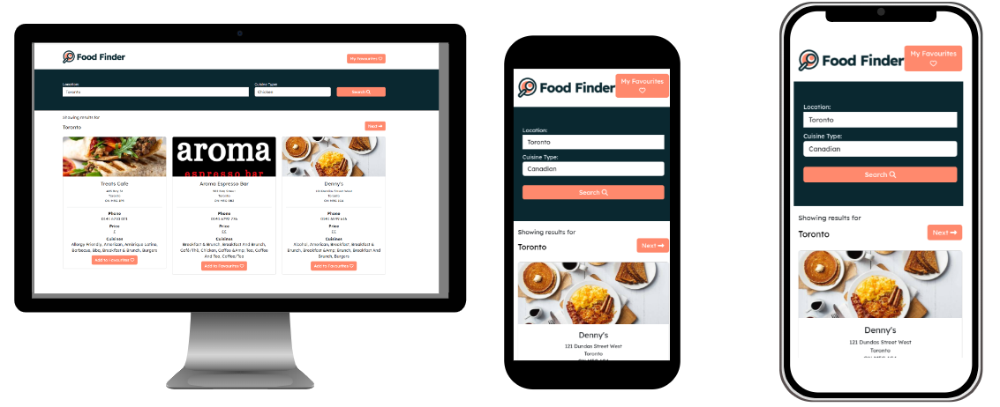

# Food Finder

## Table of Contents

* [Description of the assignment](#description-of-the-assignment)
* [Installation](#Installation)
* [Usage](#Usage)
* [Credits](#Credits)
* [Licenses](#Licenses)
* [Contact Link url to github repository](#contact-link-url-to-github-repository)
* [Reference](#Reference)

## Description

A simple web app to find restaurant recommendations

## Installation

None.

## Usage

Simply type your location select a cuisine type and press search, it will then load up multiple restaurants that fits your desire.
There is a favourite feature to help with bookmarking pleasant experiences, this is done by pressing add to favourite button and to access the list is done by pressing the "My favourites" button.

## Credits

RORY
Jedi of Javascript

DENNIS
Html/CSS

MANDY
API and Javascript

KHUMBALANI
HTML

## Contact-link URL to the deployed Github Repository 

https://uberponky.github.io/Food-Finder/index.html

## License

Please refer to the LICENSE in the repo.
